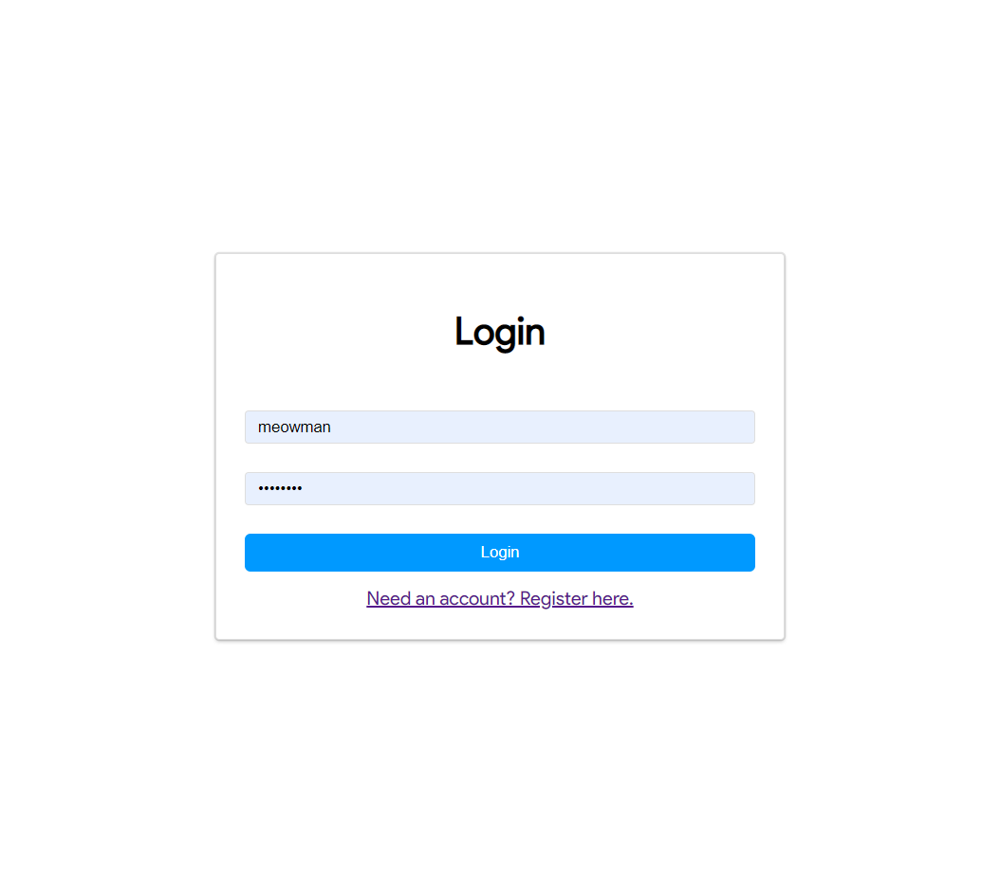
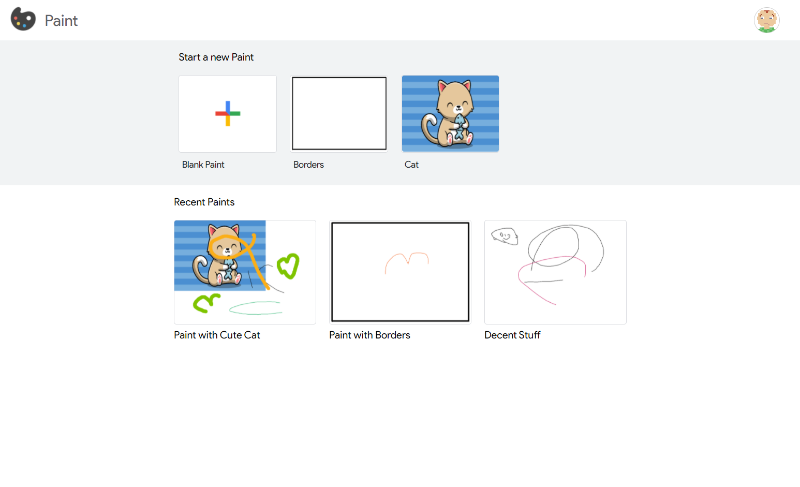
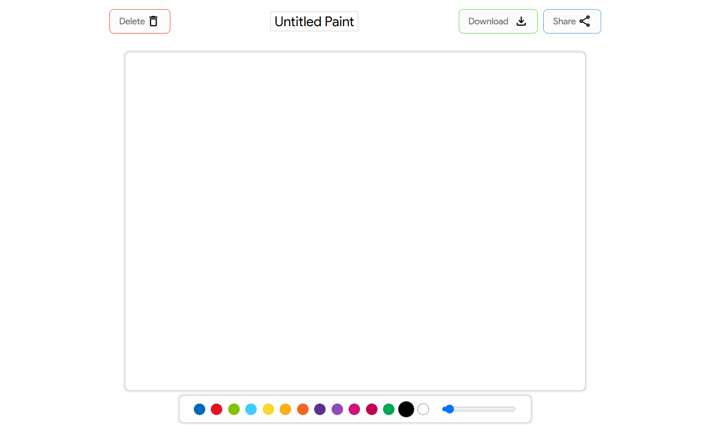
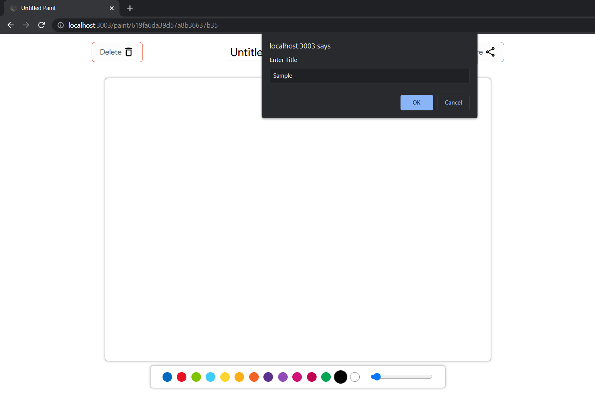
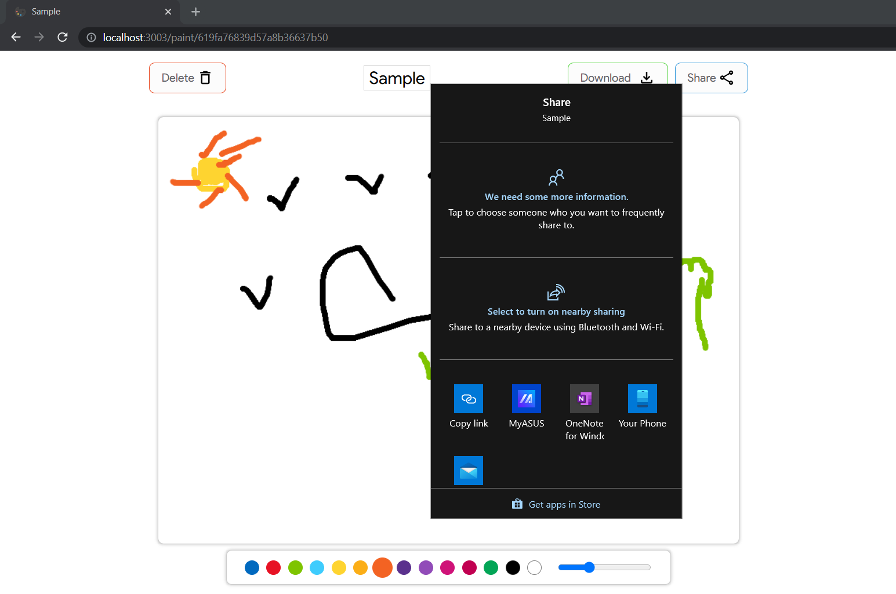
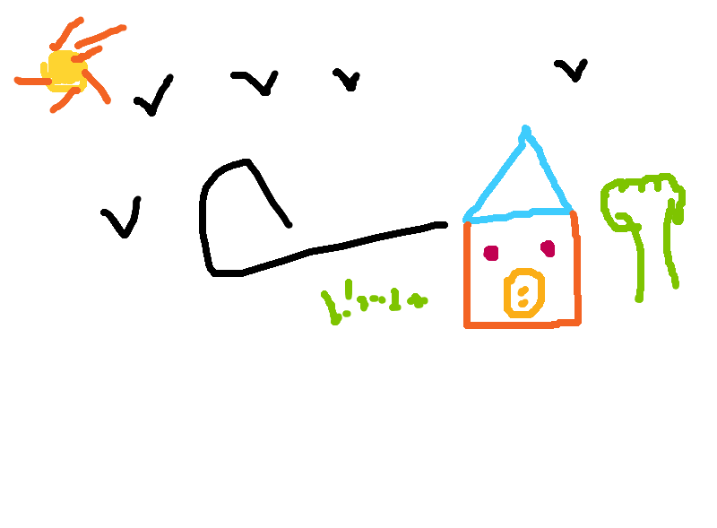
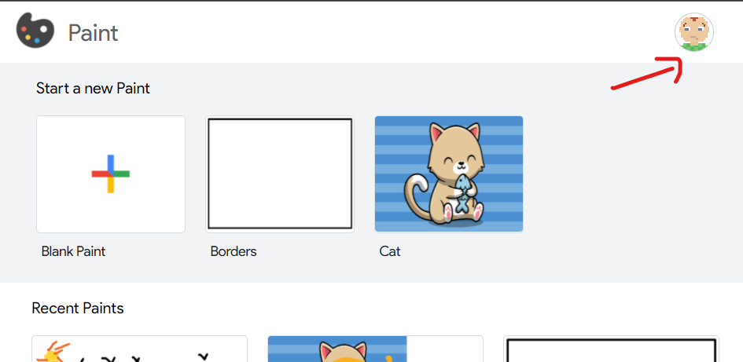
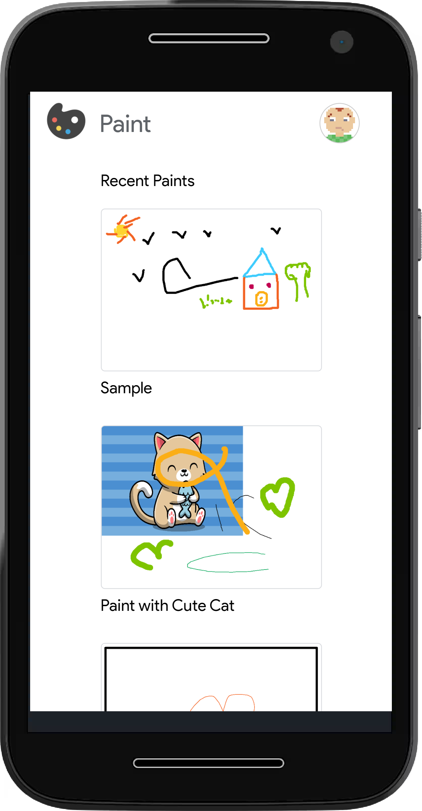
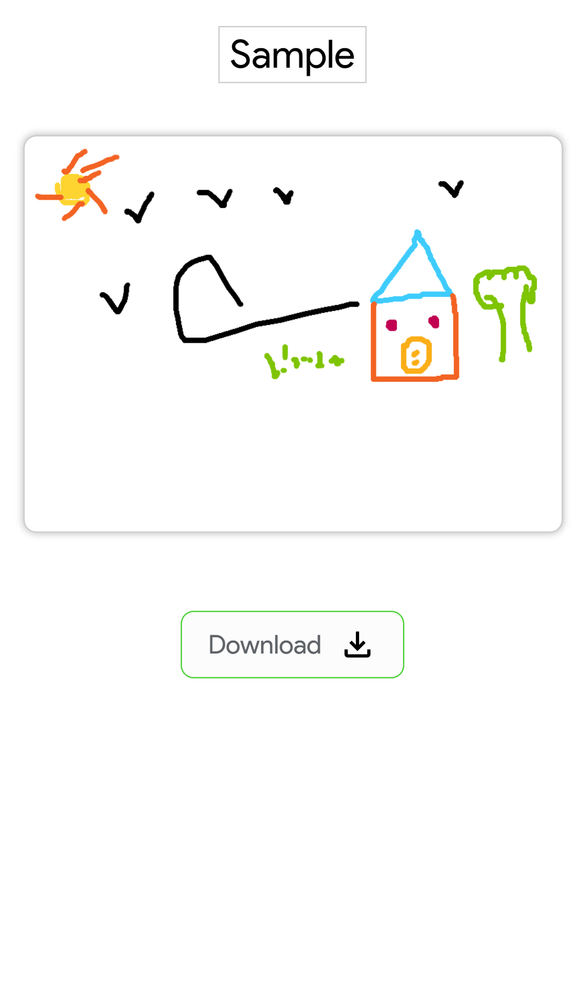

# Shareable Paint App

## Description
- [x] Paint
- [x] Share
- [x] Save
- [x] Download
- All your Paints

## Features
- [x] Paint
- [x] Number of Colors to Choose from
- [x] Multiple Default Templates to begin with
- [x] Share your Paint with the world
- [x] Download your Paint as a .png file

## Installation
- Define `MONGO_URI` and `SESSION_SECRET` as .env variables either with hosting config or inside .env file at the root
- `npm install` to install the dependencies

## Usage
- `npm start` to start the app

## Walkthrough
- [x] Login
    - Login with username or email with password
    - If you are not registered, you can register by clicking on the register button
    - 

- [x] Home Page
    - After Login the user is redirected to the home page.
    - The home page contains the list of all the paints that the user owns.
    - It also has some templates to start a new paint.
    - 

- [x] New Paint Page
    - Click on the Create New Paint Button or click on one of the templates to start a new one
    - Select any color or the size of the stylus and draw anything!
    - 

- [x] Edit Paint Title
    - Click on the heading to edit the title of the paint
    - It prompts the user to enter the new title
    - 

- [x] Share Paint
    - Click on the share button to share the paint with the world
    - 

- [x] Viewing Paint
    - Other users can view the shared Paint with the link. 
    - It appears as same if the user who owns is viewing the paint in Incognito mode.
    - 

- [x] Download Paint
    - Click on the download button to download the paint as a .png file
    - 
    - 

- [x] Logging Out
    - The Paint app autogenerates a Profile Picture for the user.
    - Click on the Profile Picture to logout
    - 

- [x] Mobile Responsiveness
    - The app is responsive on mobile devices.
    - 
    - 

## Enjoy 🎉
- [x] Desktop version done
- [x] Mobile version done
- [ ] Landing Page
- [x] Hosting on Heroku -> [https://newpaint.herokuapp.com/](https://newpaint.herokuapp.com/)

## Developers
- Me [@tharunoptimus](https://tharunoptimus.netlify.app)